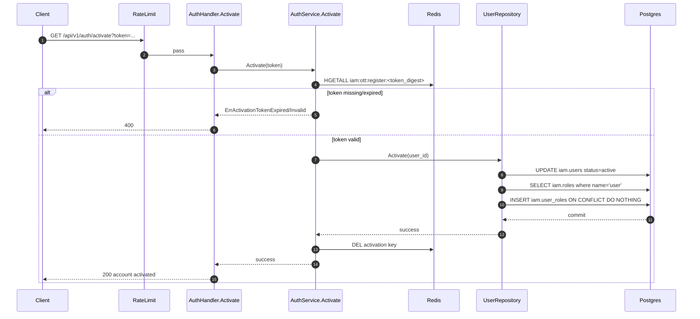

# IAM Flow: Activate Account

## Endpoint

- `GET /api/v1/auth/activate?token=...`
- Middleware: `RateLimit(auth_activate)`

## Purpose

- Consume activation token.
- Activate user and grant default role (`user`).

## Sequence Diagram

## Main Branches

1. Missing query token -> `400`.
2. Invalid or expired token -> `400`.
3. Activation role missing in DB -> internal error branch (`500`).
4. Success -> `200`.
