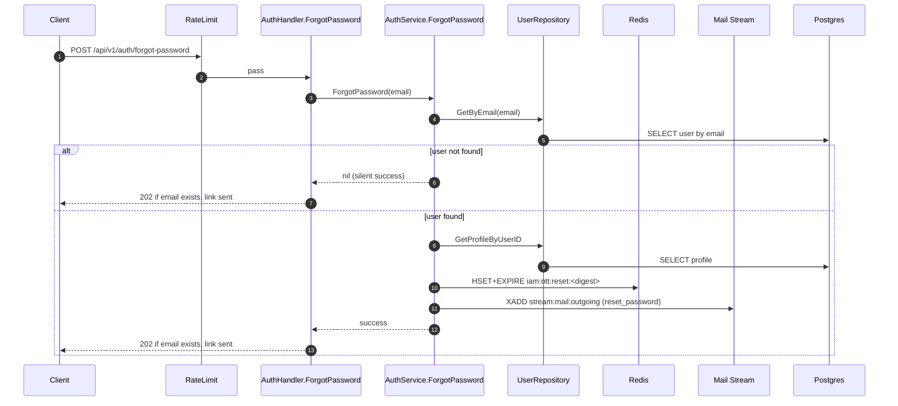

# IAM Flow: Forgot Password

## Endpoint

- `POST /api/v1/auth/forgot-password`
- Middleware: `RateLimit(auth_forgot_password)`

## Purpose

- Start reset-password flow without account enumeration.
- Always return accepted response to client.

## Sequence Diagram

## Security Notes

1. Client message is identical for existing and non-existing accounts.
2. Reset token is one-time metadata in Redis with TTL.
3. Internal errors are logged, not exposed in response details.
