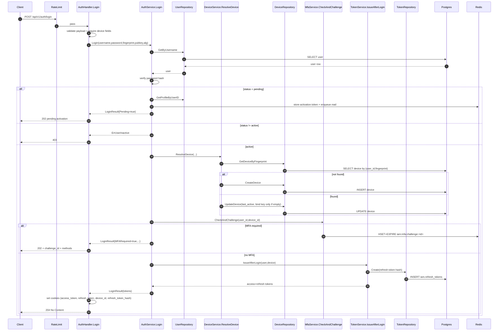

# IAM Flow: Login

## Endpoint

- `POST /api/v1/auth/login`
- Middleware: `RateLimit(auth_login)`

## Purpose

- Authenticate username/password.
- Enforce device binding at login (`device_fingerprint`, `device_public_key`).
- Branch to pending activation, MFA challenge, or direct session issuance.

## Sequence Diagram

## Response Branches

1. Bad payload or missing device fields -> `400`.
2. Invalid credentials -> `401`.
3. Inactive user -> `403`.
4. Pending account -> `202` (activation email resent).
5. MFA required -> `202` with `challenge_id`.
6. Login success -> `204` and cookies set, no token JSON body.

## Cookie Contract on Success

1. `access_token` (HttpOnly)
2. `refresh_token` (HttpOnly)
3. `device_id` (readable cookie for browser proof flow)
4. `refresh_token_hash` (readable cookie, helper hash only)
