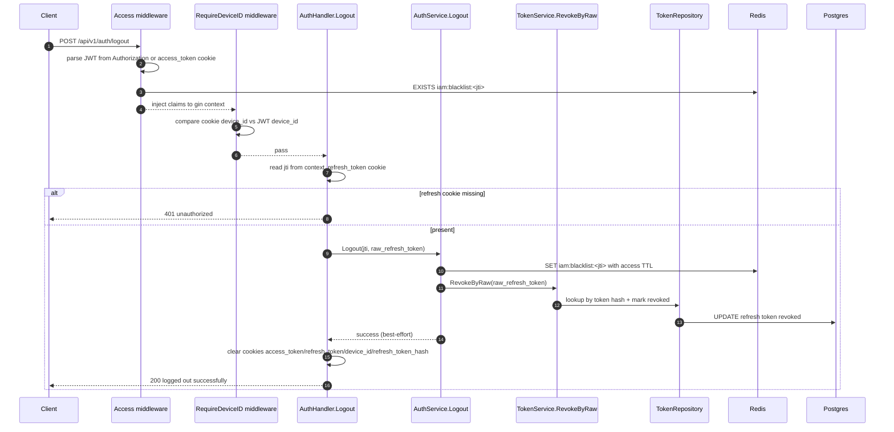

# IAM Flow: Logout

## Endpoint

- `POST /api/v1/auth/logout`
- Middleware chain:
1. `Access()`
2. `RequireDeviceID()`

## Purpose

- Invalidate current access token (`jti` blacklist).
- Revoke presented refresh token (best-effort).
- Clear all session cookies.

## Sequence Diagram

## Notes

1. Missing refresh cookie is treated as unauthorized.
2. Refresh revoke path is best-effort; cookie clearing still happens on success path.
