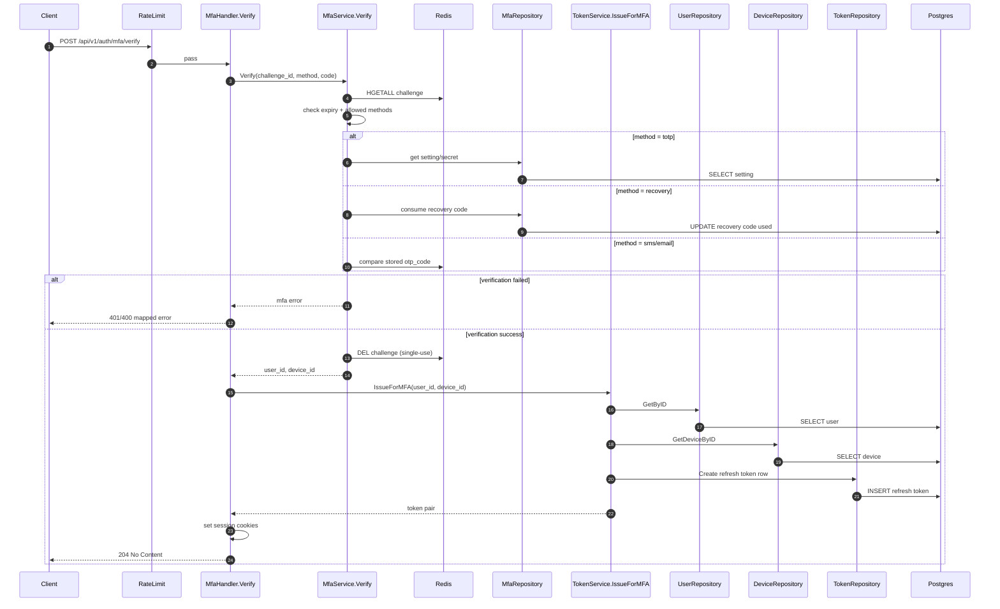

# IAM Flow: MFA Verify (Challenge Completion)

## Endpoint

- `POST /api/v1/auth/mfa/verify`
- Middleware: `RateLimit(mfa_verify)`

## Purpose

- Complete login challenge after password authentication.
- On success, issue session cookies (same as direct login success).

## Sequence Diagram

## Main Branches

1. Invalid payload -> `400`.
2. Challenge invalid/not found/expired -> `401`.
3. MFA code invalid -> `401`.
4. Success -> `204`, cookies issued, no JSON token body.
