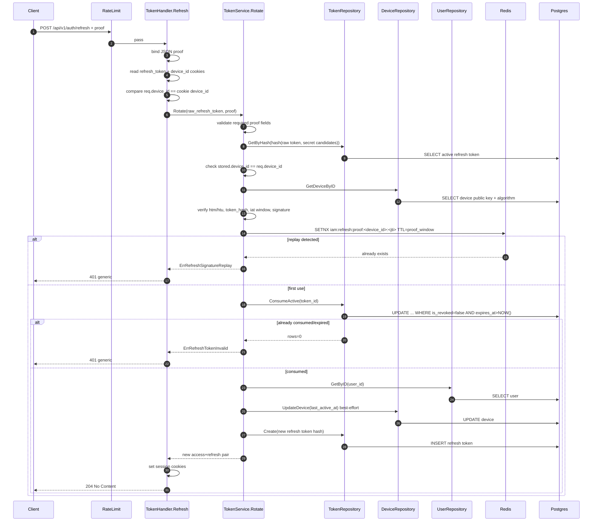

# IAM Flow: Refresh Token Rotation (DPoP-lite Proof)

## Endpoint

- `POST /api/v1/auth/refresh`
- Middleware: `RateLimit(auth_refresh)`

## Purpose

- Rotate refresh token using signed client proof.
- Prevent replay and double-consume race.

## Request Contract

1. Cookie: `refresh_token` (HttpOnly)
2. Cookie: `device_id` (readable)
3. JSON body: `jti`, `iat`, `htm`, `htu`, `token_hash`, `device_id`, `signature`

## Sequence Diagram

## Security Behavior

1. Missing refresh cookie or `device_id` cookie -> `401 unauthorized`.
2. All rotate failures (`invalid/mismatch/replay/unbound/signature`) -> generic `401`.
3. Successful refresh returns no token JSON body, only new cookies.
