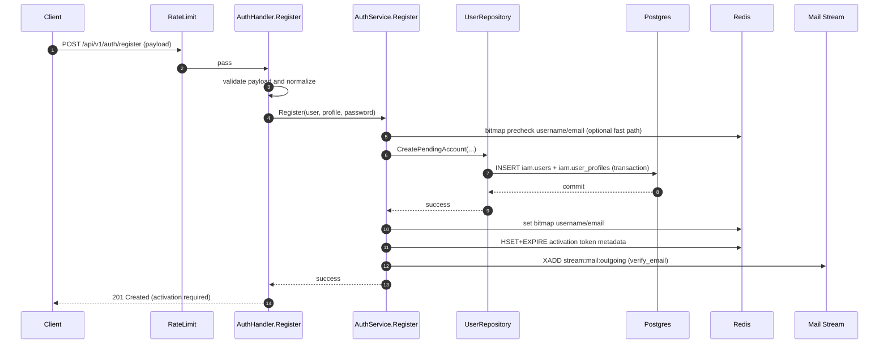

# IAM Flow: Register

## Endpoint

- `POST /api/v1/auth/register`
- Middleware: `RateLimit(auth_register)`

## Purpose

- Create a pending account (`status=pending`) and enqueue activation email.
- Do not issue tokens at this step.

## Sequence Diagram

## Main Branches

1. Invalid payload or weak password -> `400`.
2. Duplicate identity (`username/email/phone`) -> `409`.
3. Success -> `201` and account remains pending until activation.

## Security Notes

1. Password is hashed before persistence.
2. Activation token is one-time, stored in Redis with TTL.
3. No session cookies are issued in this flow.
