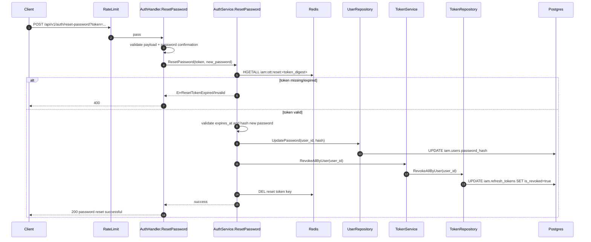

# IAM Flow: Reset Password

## Endpoint

- `POST /api/v1/auth/reset-password?token=...`
- Middleware: `RateLimit(auth_reset_password)`

## Purpose

- Validate one-time reset token.
- Update password hash.
- Revoke all user refresh tokens.

## Sequence Diagram

## Main Branches

1. Invalid payload / mismatched password confirmation -> `400`.
2. Invalid or expired reset token -> `400`.
3. Success -> `200`.
