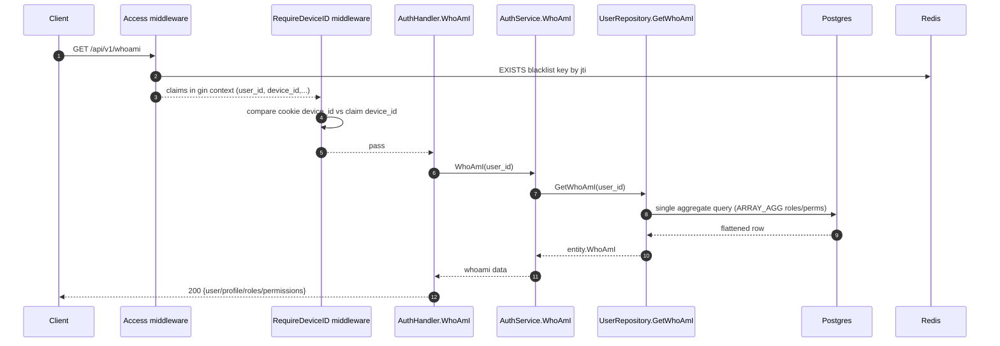

# IAM Flow: WhoAmI

## Endpoint

- `GET /api/v1/whoami`
- Middleware chain:
1. `Access()`
2. `RequireDeviceID()`

## Purpose

- Return authenticated session snapshot for UI bootstrap.
- Include identity, profile fields, roles, and permissions in one response.

## Sequence Diagram

## Main Branches

1. Missing/invalid access session -> middleware returns `401`.
2. User/profile/role not found at service boundary -> `401`.
3. Success -> `200`.

## Response Shape

- Returns one JSON object (`WhoamiResponse`) including:
1. identity fields (`user_id`, `username`, `email`, ...)
2. profile fields (`full_name`, `avatar_url`, `bio`, ...)
3. auth/session fields (`auth_type`, `level`, ...)
4. `roles[]`, `permissions[]`.
