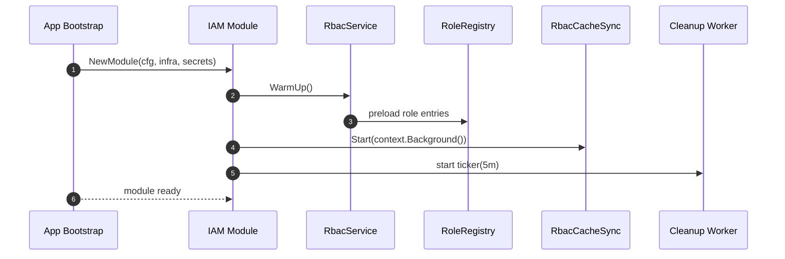
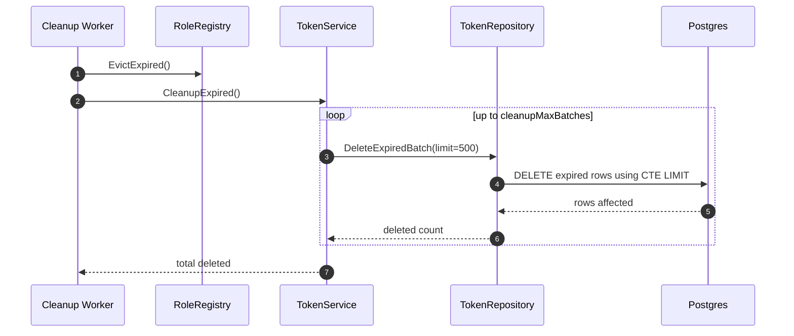
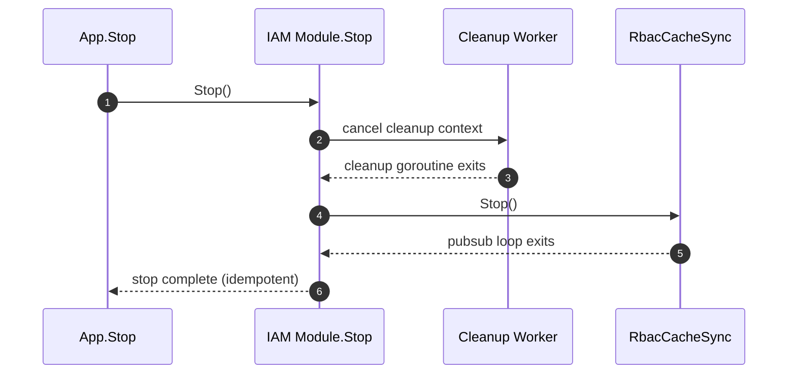

# IAM Flow: Background Workers and Shutdown

## Purpose

- Keep runtime healthy in multi-instance deployment.
- Ensure worker lifecycle is tied to IAM module lifecycle.

## Components

1. RBAC cache sync worker (`RbacCacheSync`)
2. Token cleanup worker (`TokenService.CleanupExpired` in batches)
3. RoleRegistry TTL eviction (`registry.EvictExpired()`)

## Sequence Diagram: Module Startup

## Sequence Diagram: Cleanup Tick

## Sequence Diagram: Graceful Stop

## Notes

1. Cleanup is idempotent and only touches expired refresh tokens.
2. Stop is designed to be safe for repeated calls.
3. Worker stop should run before infra shutdown so no worker uses closed DB/Redis.
