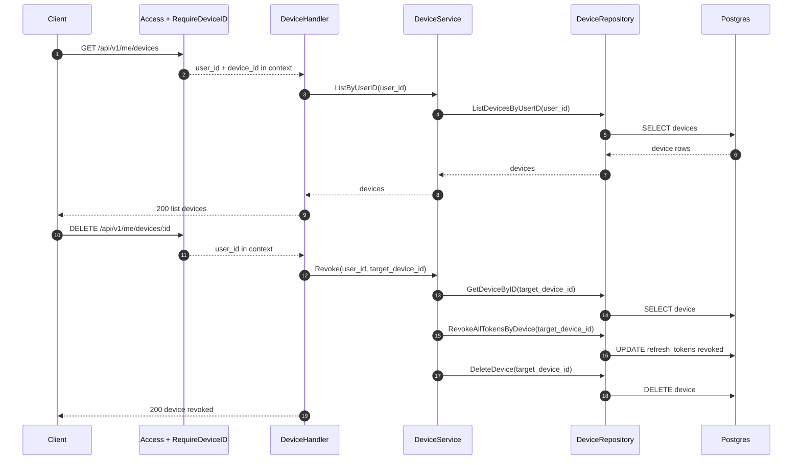
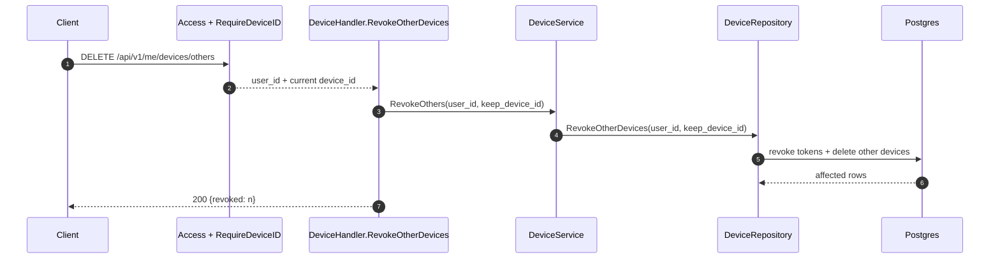
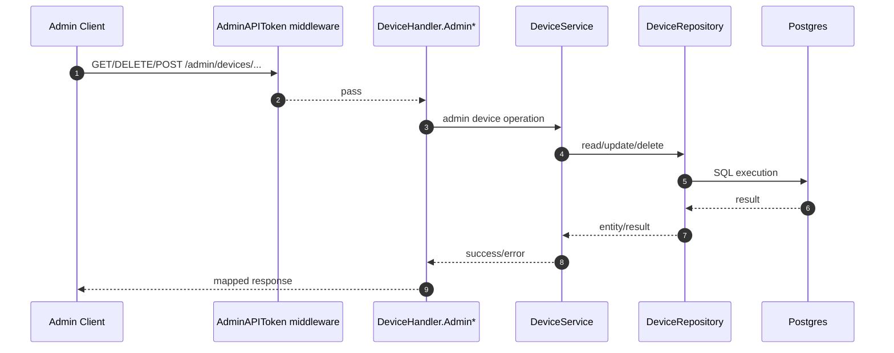

# IAM Flow: Device Management

## Endpoints

Self-service:

1. `GET /api/v1/me/devices`
2. `DELETE /api/v1/me/devices/:id`
3. `DELETE /api/v1/me/devices/others`

Admin:

1. `GET /admin/devices/:id`
2. `DELETE /admin/devices/:id`
3. `GET /admin/devices/:id/quarantine`
4. `POST /admin/devices/:id/suspicious`
5. `POST /admin/devices/cleanup`

## Middleware

Self-service routes:

1. `Access()`
2. `RequireDeviceID()`

Admin routes:

1. `AdminAPIToken()`

## Sequence Diagram: Self-Service List and Revoke

## Sequence Diagram: Revoke Other Devices

## Sequence Diagram: Admin Device Operations

## Notes

1. Device binding identity is also enforced upstream on protected user routes via `RequireDeviceID`.
2. Device key bind/rebind logic is exercised mainly during login and explicit device security operations.
