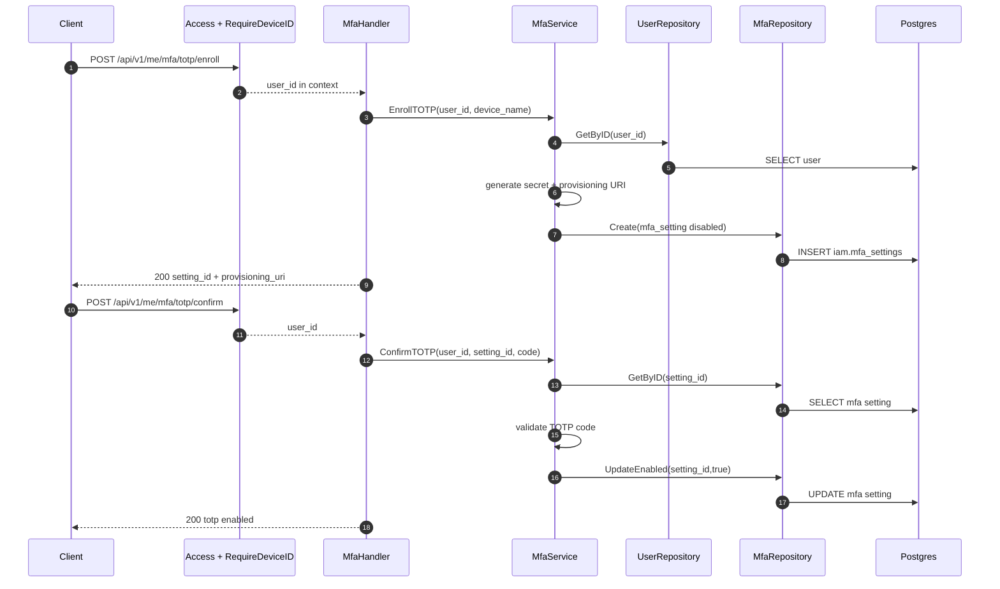
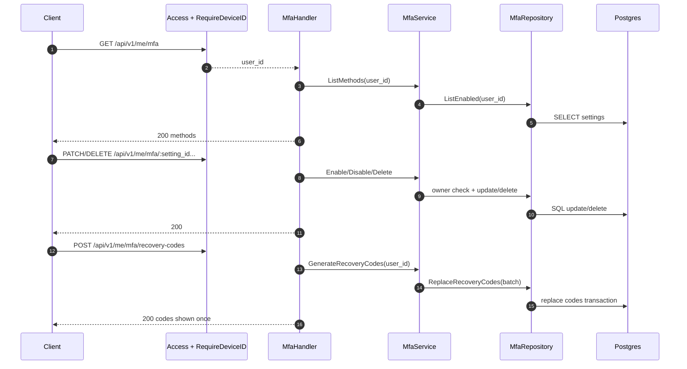

# IAM Flow: MFA Self-Service Management

## Endpoints

1. `GET /api/v1/me/mfa`
2. `POST /api/v1/me/mfa/totp/enroll`
3. `POST /api/v1/me/mfa/totp/confirm`
4. `PATCH /api/v1/me/mfa/:setting_id/enable`
5. `PATCH /api/v1/me/mfa/:setting_id/disable`
6. `DELETE /api/v1/me/mfa/:setting_id`
7. `POST /api/v1/me/mfa/recovery-codes`

## Middleware

All routes require:

1. `Access()`
2. `RequireDeviceID()`
3. Route-specific `RateLimit(...)`

## Sequence Diagram: Enroll and Confirm TOTP

## Sequence Diagram: List, Toggle, Delete, Recovery Codes

## Notes

1. Recovery codes are only returned once and must be stored by client.
2. MFA challenge verify (`/auth/mfa/verify`) is documented separately in `flow-auth-mfa-verify.md`.
