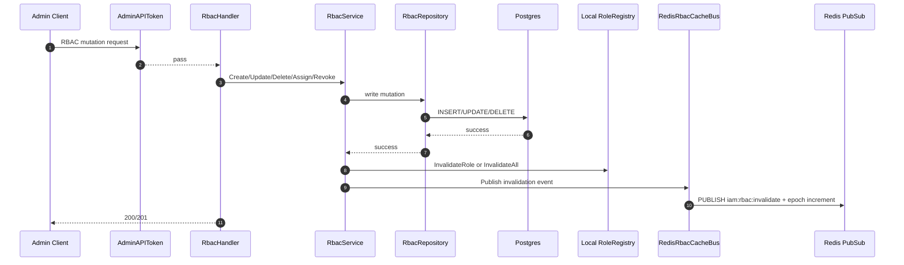
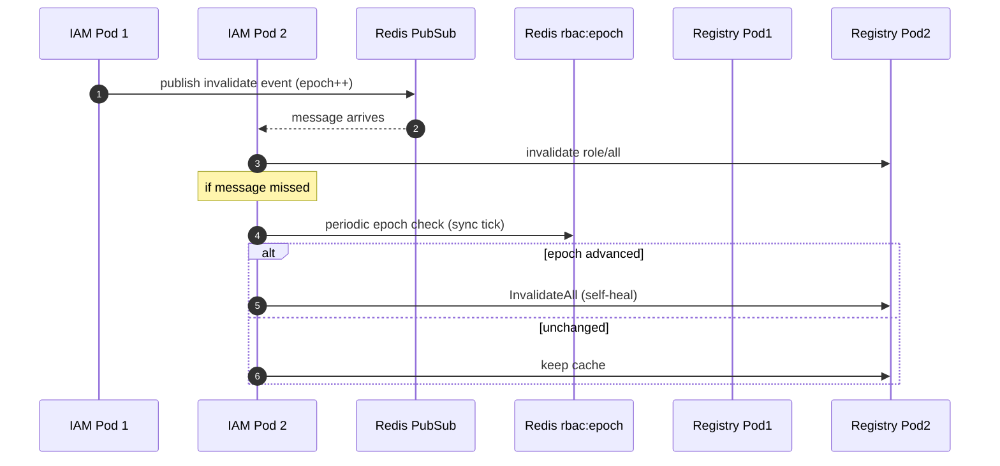

# IAM Flow: RBAC Admin and Cache Coherency

## Endpoints

1. `GET /admin/rbac/roles`
2. `POST /admin/rbac/roles`
3. `GET /admin/rbac/roles/:id`
4. `PUT /admin/rbac/roles/:id`
5. `DELETE /admin/rbac/roles/:id`
6. `GET /admin/rbac/permissions`
7. `POST /admin/rbac/permissions`
8. `POST /admin/rbac/roles/:id/permissions`
9. `DELETE /admin/rbac/roles/:id/permissions/:perm_id`
10. `POST /admin/rbac/cache/invalidate`

## Middleware

- All endpoints: `AdminAPIToken()`

## Sequence Diagram: Mutation + Invalidation Broadcast

## Sequence Diagram: Multi-Replica Self-Heal

## Notes

1. `RoleRegistry` remains fast-path cache, but not source of truth.
2. DB remains authoritative; Redis bus provides cross-replica coherence.
3. `InvalidateAll` triggers both local flush and distributed broadcast.
